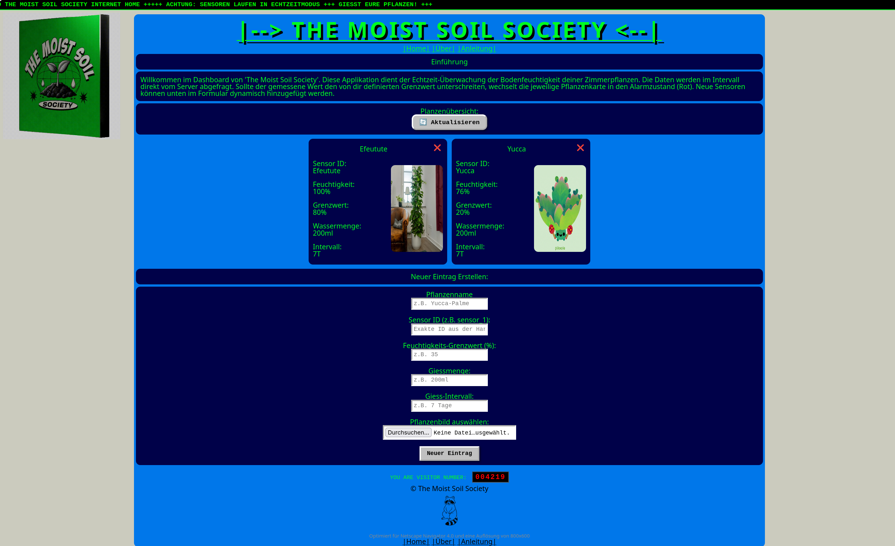

# The Moist Soil Society – Echtzeit-Bodenfeuchtigkeits-Dashboard

## 1. Abstract
The Moist Soil Society ist eine leichtgewichtige Webapplikation zur Echtzeit-Überwachung der Bodenfeuchtigkeit von Zimmerpflanzen via Webbrowser. Die serverseitige Applikation läuft auf einem Raspberry Pi, sammelt eingehende Sensordaten von Mikrocontrollern und stellt diese über eine REST-API dem Client zur Verfügung. Das Frontend bereitet die Daten visuell in einem ansprechenden 90s-Retro-Look auf und warnt Benutzer dynamisch, sobald kritische Feuchtigkeits-Grenzwerte unterschritten werden.

---

## 2. Allgemeine Funktionsweise
Die Applikation basiert auf einer klassischen Client-Server-Architektur, die für den lokalen Netzwerkbetrieb optimiert ist:

1. Datenerfassung: Ein Mikrocontroller (z. B. XIAO ESP32C6) misst die Bodenfeuchtigkeit und sendet die Daten zyklisch per HTTP-POST an den Node.js-Server.
2. Datenhaltung: Der Server speichert die Daten als schlanke .json-Dateien im Dateisystem ab.
3. Datenbereitstellung: Der Browser (Client) ruft die Daten periodisch via HTTP-GET ab und baut das Dashboard dynamisch auf. Individuelle Einstellungen (Namen, Schwellenwerte, Bilder) werden persistent im lokalen Speicher des Browsers (LocalStorage) gesichert.

### Systemarchitektur
```text
+-----------------------+                    +-------------------------------+
|    Mikrocontroller    | -- HTTP POST ----> |  Node.js Server (Raspberry Pi)|
|   (z.B. XIAO ESP32)   |                    |        [ Express-API ]        |
+-----------------------+                    +-------------------------------+
                                                             |
                                                    Speichert Daten als .json
                                                             v
+-----------------------+                    +-------------------------------+
|  Webbrowser (Client)  | <-- HTTP GET ----- |       JSON-Dateisystem        |
|  [ Retro-Dashboard ]  |      (API)         |        (sensor_data/)         |
+-----------------------+                    +-------------------------------+
```
---

## 3. Serverseitige API-Endpunkte (server)
Das Backend wurde mit Express.js in der Datei index.js realisiert und stellt folgende Endpunkte bereit:

* POST /update-sensor: Empfängt die Messdaten (sensor_id, moisture, battery) der Hardware. Erstellt oder aktualisiert die entsprechende ${sensor_id}.json-Datei im Verzeichnis sensor_data/.
* GET /get-data: Liest das gesamte sensor_data/-Verzeichnis aus, parst die JSON-Dateien und liefert ein Array aller registrierten Sensordaten an das Frontend.
* POST /api/plants: Ermöglicht die Registrierung einer neuen Pflanze über das Frontend, indem eine initiale Dummy-JSON-Datei angelegt wird.
* GET /: Liefert die statische Hauptdatei (index.html) aus dem Frontend-Verzeichnis an den Browser aus. Erzwingt via HTTP-Header eine dedizierte Content-Security-Policy (CSP), um unbefugte Skript-Ausführungen im Netzwerk zu blockieren.

---

## 4. Clientseitige Applikation (client / frontend)
Das Client-Frontend ist modular aufgebaut und verzichtet bewusst auf komplexe Frameworks, um maximale Performance und Kompatibilität zu gewährleisten:

* index.html & style.css: Definieren die Struktur und das visuelle Design. Die Ästhetik ist als Hommage an das Web 1.0 (Windows 95 / Netscape Navigator Look) inklusive Newsticker und Besucherzähler gestaltet.
* function/main.js: Initialisiert die Applikation, steuert die Event-Listener für das Erstellungs-Formular und startet das Intervall zum automatischen Refresh der Daten.
* function/api.js: Kapselt die asynchronen fetch-Aufrufe zur Kommunikation mit der Server-API.
* function/ui.js (Kernkomponente): 
    * Generiert dynamisch HTML5-Pflanzenkarten basierend auf den Serverdaten.
    * Erlaubt die direkte Bearbeitung von Grenzwerten, Namen und Intervallen über das Attribut contenteditable.
    * Ermöglicht den lokalen Bild-Upload per FileReader.
    * Verwaltet die Datenspeicherung im LocalStorage, damit Einstellungen browserspezifisch erhalten bleiben.
    * Überwacht die Schwellenwerte und triggert visuelle CSS-Alarme (.alert-threshold), wenn eine Pflanze gegossen werden muss.

### Client-Screenshot


---

## 5. Leitfaden zur Inbetriebnahme

### Voraussetzungen
* Installiertes Node.js (v16 oder höher) auf dem Raspberry Pi.
* PM2 zur permanenten Prozessüberwachung im Hintergrund.

### Schritt 1: Installation
Klone das Repository auf den Raspberry Pi und installiere die Abhängigkeiten im Hauptverzeichnis:
git clone <dein-repository-url>
cd wlw_moistureApp
npm install

### Schritt 2: Server starten
Starte die Applikation mit dem Prozessmanager PM2, damit der Server auch nach Verbindungsabbrüchen stabil im Hintergrund weiterläuft:
pm2 start index.js --name "moisture-app"
pm2 save

### Schritt 3: Zugriff im Netzwerk
Die Webapplikation ist nun im selben lokalen Netzwerk einsatzbereit. Öffne einen beliebigen modernen Webbrowser und rufe die IP-Adresse deines Raspberry Pi auf Port 3000 auf:
http://<IP-DEINES-RASPBERRY-PI>:3000

(Beispiel: http://192.168.0.52:3000)
